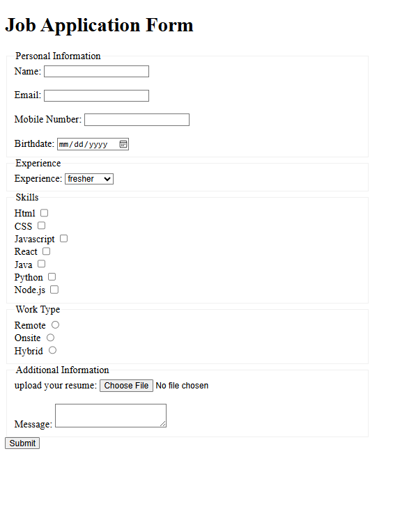

# Purva Jadhav — Job Application Form

A structured job application form built using pure HTML.  
It collects user details like personal information, skills, experience, and resume upload.

---

## 🌐 Live Demo
[View Live Site](https://astounding-horse-a27f13.netlify.app/)

---

## 📸 Screenshot


---

## 📖 About This Project
This project is a job application form created using only HTML5.  
The main goal was to understand how forms work, how to collect different types of user input, and how to structure forms using semantic elements like fieldset and legend.

---

## 🛠 Built With
- HTML5 (pure — no CSS, no JavaScript)

---

## ✨ Features
- Structured form using `<fieldset>` and `<legend>`
- Personal information section (name, email, phone, birthdate)
- Experience selection using dropdown (`<select>`)
- Skills selection using checkboxes
- Work type selection using radio buttons
- Resume upload using file input
- Message box with minimum character validation
- Required field validation using HTML attributes
- Clean and readable HTML code

---

## 🚀 Usage
1. Clone this repository  
   ```bash
   git clone https://github.com/Purvjadh/Job-Application-Form-using-HTML-only
   ```

2. Open the project folder  

3. Open `index.html` in your browser  

4. Fill the form and test different inputs  

---

## 📚 Learning Outcomes
- Understanding HTML forms and input types  
- Using `<input>` types like text, email, tel, date, file  
- Creating dropdowns using `<select>` and `<option>`  
- Using checkboxes and radio buttons correctly  
- Grouping form elements using `<fieldset>` and `<legend>`  
- Applying validation using `required`, `minlength`  
- Writing clean and structured HTML  

---

## 👩‍💻 Author
Purva Jadhav  
- LinkedIn: https://www.linkedin.com/in/purva-jadhav-5590572b4
- GitHub: https://github.com/Purvjadh
